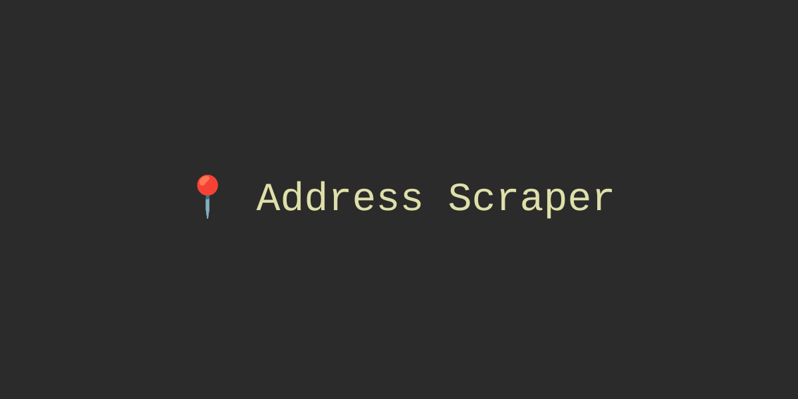

# Address Scraper


## A Python project that scrapes US addresses!

This project scrapes US addresses from the Realty in US API in RapidApi and returns it as a CSV file. The user also has the option to display the scraped addresses to a map.

It includes the following features:
- Customizable API request calls
- Map display of the scraped addresses

## Dependencies
- python 3.10+
- poetry
- pydantic
- requests
- pandas
- geopy
- folium

## Installation instructions
1. Clone this project.
2. Install poetry.  ``` pip install poetry ```

## Usage instructions
1. Run ``` poetry install ``` in the directory of the project.
2. Run ``` poetry shell ```.
3. Run the project using ``` python address_scraper/scraper.py ``` to see the usage.